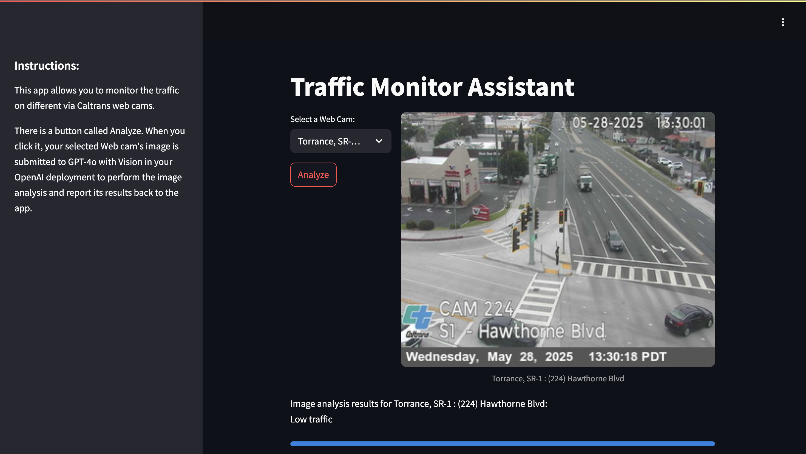

# GPT-4o with Vision: Traffic Monitor Assistant
In this repo, you will find the source code of a Streamlit Web app that analyzes the traffic across California via Caltrans web cams of major freeways/junctions.

This Web app is an adaptation of [LazaUK/AOAI-GPT4Vision-Streamlit-SDKv1](https://github.com/LazaUK/AOAI-GPT4Vision-Streamlit-SDKv1) and is [hosted on Google Cloud Run](https://traffic-monitor-269576596860.us-central1.run.app/) using a Docker container. If you would like to run the app locally on your computer, follow the original implementation details - you will require access to an OpenAI endpoint to interact with the GPT-4o Vision model.

This demo was built on the latest OpenAI Python SDK v1.x. To upgrade your _openai_ Python package, please use the following pip command:
```
pip install --upgrade openai
```

## Table of contents:
- [Part 1: Configuring solution environment](https://github.com/tyeoh9/GPT4oVisionTrafficMonitor?tab=readme-ov-file#part-1-configuring-solution-environment)
- [Part 2: Web app - User Guide](https://github.com/tyeoh9/GPT4oVisionTrafficMonitor?tab=readme-ov-file#part-2-web-app---user-guide)
- [Part 3: Web app - Developer Guide](https://github.com/tyeoh9/GPT4oVisionTrafficMonitor?tab=readme-ov-file#part-3-web-app---developer-guide)
- [Notes & Acknowledgements](https://github.com/tyeoh9/GPT4oVisionTrafficMonitor?tab=readme-ov-file#notes--acknowledgements)

## Part 1: Configuring solution environment
1. To use API key, you need to first obtain a key from [openai.com](https://openai.com). There are many ways to use the key safely, but a common way to do it (on Mac) is to store the key as a temporary environment variable, like so:
```
export OPENAI_API_KEY="{YOUR_API_KEY}"
```
2. Install the required Python packages, by using the **pip** command and the provided requirements.txt file.
```
pip install -r requirements.txt
```

## Part 2: Web app - User Guide
1. To launch the Web app, you should run the following command from this repo's root folder
```
streamlit run GPT4V_Streamlit.py
```
2. If everything was installed correctly as per the Part 1's instructions above, you should be able to access the demo solution's Web page at http://localhost:8501 locally.

3. The UI is very minimalistic. You need to select an option fromthe web cam drop down list, first, to display a webcam image.
4. Then you can click the Analyze button to submit the selected image to the OpenAI API.
>**Note**: As a Generative AI solution, GPT-4o with Vision is not deterministic. So, you may get slightly different descriptions of the same image if it's alayzed several times, which is expected.

## Part 3: Web app - Developer Guide
1. This Web app is based on Streamlit, an open source Python framework, and doesn't require an explicit setup of a Web service or programming in any other languages but Python.
2. The **image_paths** dictionary contains button names for Web cams and associated JPEG images of the traffic cameras. If you want to use your own images, just update the relevant references.
``` Python
image_paths = {
    "Web cam # 1": "images/im1.jpg",
    "Web cam # 2": "images/im1.jpg",
    "Web cam # 3": "images/im1.jpg",
    "Web cam # 4": "images/im1.jpg",
    ...
}
```

## Notes & Acknowledgements
1. The original implementation details are described in the [LazaUK/AOAI-GPT4Vision-Streamlit-SDKv1](https://github.com/LazaUK/AOAI-GPT4Vision-Streamlit-SDKv1) repo.
2. All the images are taken from [Caltrans' live cameras](https://cwwp2.dot.ca.gov/vm/streamlist.htm).
3. Some cameras may be temporarily available - that is out of our control.